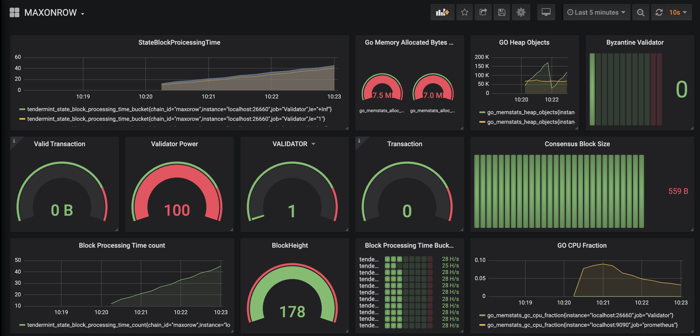

# MXW- Dashboard

 MXW-Dashboard is the graphical representation of MXW blockchain. With help of metrics, we can fetch real time value from the current running node and dispay it into GUI fomat. We use the prometeus and grafana dashboard.

## Set-up

## Key Requirements

- [Git Clone the MXW Repo](https://gitlab.com/mxw-blockchain/maxonrow-go.git), Powered by Tendermint & Cosmos.

- [Install Prometheus](https://prometheus.io/download/), Download and install the prometheus.
  interfaces
- [Install the Grafana](https://grafana.com/get),  Grafana which is build for rich ui with multiple pulgin

## Build and Run

1. You  have to  clone the  Maxonrow blockchain and have to build and initialise the project. Follow the instruction to build and initialise the maxonrow project as explained in  MXW repo.

2. Now considering, mxw config already created in your root directories using the above MXW link.

   * Go to root directory of mxw. Please make sure your in the current directory of ./mxw

         cd  $HOME/.mxw

   * MXW config.toml file need to be updated in the prometheus section inside the mxw initialized folder.

         prometheus = true
         prometheus_listen_addr = ":26660"

    * Run the mxw using the below cmd

           ./build/mxwd start --home ~/.mxw

3. Run the prometeus

  * After the installation of prometheus. We have to add the MXWONROW blockchain prometheus exposed port number (Which we can get from config.toml file) into  prometheus config file in scrape_configs section.

              - job_name: 'Validator'
                static_configs:
             - targets: ['localhost:26660']

  *  Run the prometheus

         ./prometheus --config.file=prometheus.yml

***NOTE**: : Default port number for prometeus is http://localhost:9090. We can change port number by updating the prometheus.yml file in prometheus root directory*

4. Run the Grafana

         brew services start  grafana

   * Grafana will the serve at the port number  http://localhost:3000. Login to grafana

   * Once login grafana, go to dashboard, select the import option and paste the MAXONROW-Dashboard.json file into it and give name MXW in the name filed.

***NOTE**: Above brew cmd for mac-os, please check grafana website to running the grafana in different os.*

  * you can find the Dashboard similar to bleow image.

# Contributing

Please do contribute on this project by adding multiple metrics and updating maxonrow-dashboard.json file.Please abide by the Code of Conduct in all interactions, and the contributing guidelines when submitting code.

Join the larger community on the forum and the chat.

Learn more by reading the code and comparing it to the specification.

